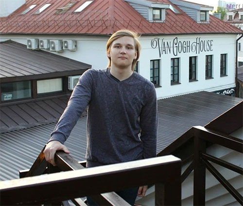

# **Alexey Matsyl**

## Junior Frontend Developer  


## Contact information  
 * **Phone:**  +375 29 8341500 

 * **E-mail:** Leksij-1@mail.ru  

 * **Telegram:** @alexey_kami  

 * [**GitHub**](https://github.com/AlexiyKami)  

***

## About me
 > Hello. I am 20 years old.  
 > I want to learn JavaScript.   
 > My goal is to gain knowlegde and skills in RSS School to become a proficient Front-End developer.  


***  

## Skills
 * HTML5, CSS3
 * C# basics
 * JavaScript basics
 * Git, GitHub
 * VSCode
 * Adobe Photoshop, Illustrator
 * Blender 3D  

 ***  
 
## Code example
*Write function bmi that calculates body mass index (bmi = weight / height2).*

*if bmi <= 18.5 return "Underweight"*

*if bmi <= 25.0 return "Normal"*

*if bmi <= 30.0 return "Overweight"*

*if bmi > 30 return "Obese"*
```

function bmi(weight, height) {
  let result = weight/(height)**2;
  if(result<=18.5){
    return "Underweight";
  } else if(result<=25.0){
      return "Normal";
    } else if(result<=30.0){
        return "Overweight";
      } else{
        return "Obese";
      }    
  
}
```  

***  

## Education
Belorussian National Technical University - Exploitation of Intelligent Transport Systems  
RSSchool - In process  

***  

## Languages
Russian - Native  
English - A2  

***
